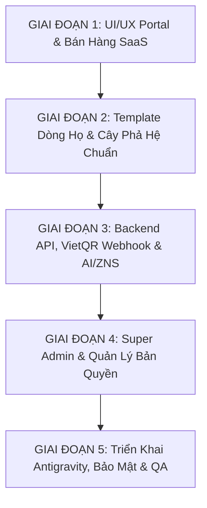

# Kế hoạch Thực hiện Tuần tự: Nâng cấp Nền tảng SaaS giatoc.online (Hạ tầng Antigravity)

Tài liệu này phân rã toàn bộ lộ trình phát triển và nâng cấp hệ thống `giatoc.online` thành các task cụ thể, rõ ràng, độc lập và có thể thực thi tuần tự theo yêu cầu của bạn.

---

## Danh Mục Các Giai Đoạn & Task Chi Tiết



---

### GIAI ĐOẠN 1: Chuẩn Hóa UI/UX Portal Bán Hàng `giatoc.online` & Design System
> **Mục tiêu**: Biến trang chủ `giatoc.online` thành một landing page bán SaaS chuyên nghiệp, sang trọng (phong cách Hoàng kim & Giấy điệp truyền thống), tỷ lệ chuyển đổi cao.

- [ ] **Task 1.1: Nâng cấp Hero Section & Interactive Mini Family Tree Widget**
  - Cập nhật Headline/Subheadline chuẩn chuyển đổi cao (theo bản thiết kế).
  - Tích hợp ô kiểm tra nhanh Subdomain khả dụng ngay tại Hero (VD: nhập `nguyenduy` -> kiểm tra tức thì `nguyenduy.giatoc.online`).
  - Thêm widget trải nghiệm nhanh Cây phả hệ mẫu tương tác trực quan ngay tại Hero mà không cần tải trang mới.
  - Tích hợp bộ đếm thống kê thời gian thực (250+ Dòng họ, 120.000+ Con cháu).
  - *Files liên quan*: `src/pages/PortalLandingPage.jsx`, `src/index.css`.

- [ ] **Task 1.2: Thiết kế 3 Khối Trụ Cột Giá Trị (USP) & Showcase Tính Năng**
  - Khối 1: Cây Phả Hệ Đa Thế Hệ (Hiển thị preview zoom, ảnh chân dung, lọc chi họ).
  - Khối 2: Bản Đồ Lăng Mộ GPS & Kỷ Yếu Di Tích (Hiển thị preview định vị vệ tinh và dẫn đường).
  - Khối 3: Sổ Quỹ Minh Bạch & Báo Giỗ Zalo ZNS Tự Động (Hiển thị preview tin nhắn Zalo gửi đến điện thoại).
  - Thêm Showcase Trợ Lý AI Xưng Hô Dòng Tộc & Bàn Thờ Số.
  - *Files liên quan*: `src/pages/PortalLandingPage.jsx`.

- [ ] **Task 1.3: Cải tiến Bảng Giá SaaS & Bảng So Sánh Tính Năng (Feature Matrix)**
  - Hiển thị 3 gói chính: Gói Cơ Bản (590k/năm), Gói Tiêu Chuẩn (1.290k/năm - Best Choice), Gói Đại Tộc (2.490k/năm).
  - Bổ sung bộ chọn chu kỳ thanh toán: 1 Năm, 2 Năm (Giảm 10%), 5 Năm (Tặng In Kỷ Yếu).
  - Bảng so sánh 15 tiêu chí tính năng chi tiết dạng ma trận trực quan.
  - *Files liên quan*: `src/pages/PortalLandingPage.jsx`.

- [ ] **Task 1.4: Nâng Cấp Luồng Checkout & Quét Mã VietQR 24/7 (`RegistrationModal`)**
  - Form nhập thông tin 2 bước rút gọn tối đa (chỉ cần SĐT, Họ tên, Tên dòng họ).
  - Sinh mã VietQR động theo chuẩn NAPAS 24/7 (chứa số tiền chính xác và cú pháp đơn hàng `GTxxxxx`).
  - Đồng hồ đếm ngược giao dịch và cơ chế tự động thăm dò (polling / WebSocket) kích hoạt website ngay khi tiền vào tài khoản.
  - *Files liên quan*: `src/components/RegistrationModal.jsx`.

---

### GIAI ĐOẠN 2: Nâng Cấp Template Dòng Họ Chuẩn (`hotrandinh.com` Model & Multi-Tenancy)
> **Mục tiêu**: Hoàn thiện toàn bộ các trang chức năng của website dòng họ mẫu, mượt mà trên mobile và tối ưu trải nghiệm.

- [ ] **Task 2.1: Tối ưu Hóa Component Cây Phả Hệ Tương Tác (`FamilyTreePage` & `AdminFamilyTree`)**
  - Virtualization & Canvas SVG: Tăng tốc độ zoom/pan mượt mà khi dữ liệu có hàng nghìn thành viên.
  - Bloodline Path Highlighter: Nhấn vào thành viên bất kỳ sẽ sáng rõ đường dẫn huyết thống từ cụ Thủy Tổ đến người đó.
  - Modal thông tin chi tiết: Xem tiểu sử, ngày giỗ âm/dương, chức tước, ảnh kỷ yếu và nút xem mộ phần GPS.
  - Cổng Riêng Tư (Privacy Gatekeeper): Tự động che số điện thoại đối với khách ngoài họ, yêu cầu xác thực con cháu để mở khóa.
  - *Files liên quan*: `src/pages/FamilyTreePage.jsx`, `src/components/AdminFamilyTree.jsx`, `src/components/MemberProfileModal.jsx`.

- [ ] **Task 2.2: Nâng Cấp Engine Import / Export Excel & Kiểm Tra Chu Trình DAG**
  - Nâng cấp bộ đọc Excel với thuật toán phát hiện chu trình đồ thị (DAG Cycle Detection) ngăn chặn treo web khi người dùng nhập sai quan hệ cha-con.
  - Xuất dữ liệu chuẩn phả hệ quốc tế GEDCOM 5.5.1.
  - Xuất file PDF sách kỷ yếu gia tộc dàn trang A4/A3.
  - *Files liên quan*: `src/utils/excelParser.js`, `src/components/AdminFamilyTree.jsx`.

- [ ] **Task 2.3: Hoàn Thiện Các Phân Hệ: Bản Đồ GPS, Sổ Quỹ Thu Chi & Bàn Thờ Số**
  - Bản đồ Lăng mộ (`TombMapPage`): Tích hợp Leaflet bản đồ vệ tinh, danh sách mộ phần theo thế hệ, nút mở Google Maps chỉ đường.
  - Sổ Quỹ (`Finance` & `AdminChiFinance`): Minh bạch thu chi, lọc theo Chi phái, đính kèm ảnh hóa đơn chứng từ.
  - Bàn Thờ Số & Tưởng Niệm: Không gian tưởng nhớ trực tuyến cho con cháu xa quê thắp nén nhang tri ân ngày lễ giỗ.
  - *Files liên quan*: `src/pages/TombMapPage.jsx`, `src/pages/Finance.jsx`, `src/components/OceanScene.jsx`.

- [ ] **Task 2.4: Cơ Chế Đổi Thương Hiệu Động (Dynamic Branding & Preset Themes)**
  - Tự động thay đổi Tên Dòng Họ, Câu đối, Logo, Huy hiệu và Màu sắc chủ đạo theo cấu hình `tenant_id`.
  - Hỗ trợ gói Preset Dòng họ mẫu (1-Click Clan Cloner).
  - *Files liên quan*: `src/store.jsx`, `src/App.jsx`.

---

### GIAI ĐOẠN 3: Backend API, VietQR Webhook & Tích Hợp AI / Zalo ZNS
> **Mục tiêu**: Xây dựng backend xử lý đơn hàng tự động, bảo mật và kết nối các dịch vụ thông minh.

- [ ] **Task 3.1: Nâng Cấp Core Backend Multi-Tenancy & Phân Quyền 5 Cấp RBAC**
  - Xác thực JWT an toàn trong HttpOnly Cookie.
  - Middleware phân giải Tenant tự động qua Subdomain hoặc Custom Domain.
  - Khóa chặt API chống rò rỉ dữ liệu giữa các dòng họ (Tenant Data Isolation).
  - *Files liên quan*: `api/helpers.php`, `api/config.php`, `api/users.php`.

- [ ] **Task 3.2: Tối Ưu Webhook VietQR (Casso / SeAPay) & Auto-Provisioning Engine**
  - Xử lý Webhook ngân hàng an toàn (kiểm tra token chữ ký, chống trùng lặp Idempotency).
  - Tự động tạo Tenant mới trong DB, cấp hạn ngạch thành viên, dung lượng lưu trữ và hạn dùng 1 năm trong vòng 30 giây.
  - Tự sinh tài khoản Super Admin dòng họ và mã License Key mã hóa.
  - *Files liên quan*: `api/orders.php`, `api/schema.sql`.

- [ ] **Task 3.3: Tích Hợp Cổng Tin Nhắn Zalo Cloud ZNS & Chiến Dịch Báo Giỗ**
  - Kết nối Zalo OA API gửi tin nhắn ZNS chăm sóc và nhắc ngày giỗ tự động.
  - Quản lý Ví tiền dòng họ (Nạp tiền, khấu trừ cước theo tin gửi).
  - Trình tạo chiến dịch gửi tin (Lọc theo Toàn họ / Chi phái / Chưa đóng quỹ).
  - *Files liên quan*: `api/zns_campaigns.php`, `api/zns_wallet.php`.

- [ ] **Task 3.4: Tích Hợp Trợ Lý AI Xưng Hô Gia Tộc (Gemini Flash API)**
  - Trợ lý AI phân tích cây gia phả để giải đáp quan hệ xưng hô họ hàng chuẩn phong tục Việt Nam.
  - Hỗ trợ AI OCR đọc ảnh gia phả chữ Nho / chữ Hán cổ sang chữ Quốc ngữ.
  - *Files liên quan*: `api/kinship_ai.php`, `src/components/KinshipAssistantModal.jsx`.

---

### GIAI ĐOẠN 4: Bảng Điều Khiển Quản Trị Nền Tảng (Super Admin Dashboard)
> **Mục tiêu**: Cung cấp công cụ quản trị tập trung cho chủ nền tảng `giatoc.online` theo dõi toàn bộ các dòng họ.

- [ ] **Task 4.1: Hoàn Thiện `PlatformSuperAdminPage` Quản Lý Dòng Họ & Bản Quyền**
  - Quản lý danh sách tất cả các dòng họ (Active, Expired, Suspended).
  - Cấp mới, gia hạn, nâng cấp gói và thu hồi License Key.
  - Thống kê tài nguyên sử dụng (Số thành viên, dung lượng đĩa NVMe, số lượt truy cập).
  - *Files liên quan*: `src/pages/PlatformSuperAdminPage.jsx`, `api/platform_tenants.php`.

- [ ] **Task 4.2: Phân Hệ Kế Toán Doanh Thu & Hệ Thống Nhắc Gia Hạn Tự Động**
  - Thống kê doanh thu bán License và doanh thu nạp ví Zalo ZNS theo ngày/tháng/năm.
  - Tự động gửi tin nhắn Zalo / Email nhắc gia hạn dịch vụ trước 30 ngày, 15 ngày, 7 ngày.
  - Cơ chế Ân hạn (Grace Period 15 ngày ở chế độ Read-only trước khi tạm ngưng).
  - *Files liên quan*: `api/cron_renewals.php`, `src/pages/PlatformSuperAdminPage.jsx`.

---

### GIAI ĐOẠN 5: Triển Khai Hạ Tầng Antigravity, Tối Ưu SEO, Bảo Mật & QA Go-Live
> **Mục tiêu**: Đảm bảo hệ thống vận hành hoàn hảo trên hạ tầng Antigravity với độ tin cậy và bảo mật cao nhất.

- [ ] **Task 5.1: Cấu Hình Triển Khai Container & Caddy Server v2 (On-Demand TLS)**
  - Thiết lập Docker Compose cho Portal, Backend API, Postgres/MySQL và Redis.
  - Cấu hình Caddyfile tự động cấp chứng chỉ SSL Let's Encrypt cho Subdomain và Custom Domain của khách.
  - *Files liên quan*: `Caddyfile`, `DEPLOY.md`.

- [ ] **Task 5.2: Tối Ưu SEO Toàn Diện & Hiệu Năng Core Web Vitals**
  - Thẻ Meta động, Dynamic OpenGraph image cho từng dòng họ khi chia sẻ Facebook/Zalo.
  - Schema.org JSON-LD (`SoftwareApplication`, `Product`, `FAQPage`).
  - Kiểm tra đạt chuẩn Core Web Vitals (LCP < 1.2s, INP < 100ms, CLS = 0).
  - *Files liên quan*: `index.html`, `public/robots.txt`, `public/sitemap.xml`.

- [ ] **Task 5.3: QA Testing Toàn Diện & Kịch Bản Kiểm Thử**
  - Kiểm thử thanh toán quét mã VietQR thật với 3 ngân hàng khác nhau.
  - Kiểm thử tải trọng cây phả hệ 2.000 thành viên trên iPhone và Android.
  - Kiểm thử bảo mật (chặn Stored XSS, kiểm tra whitelist upload ảnh, xác thực cổng che SĐT).

---

## Kế Hoạch Xác Minh & Kiểm Thử (Verification Plan)

### Kiểm thử Tự động & Build
```powershell
# 1. Kiểm tra build frontend không có lỗi cú pháp hoặc xung đột dependencies
npm run build

# 2. Kiểm tra server dev chạy mượt mà
npm run dev
```

### Kiểm thử Thủ công (Manual QA)
1. **Kiểm thử Luồng Mua License**: Mở Portal $\rightarrow$ Nhập subdomain thử nghiệm $\rightarrow$ Quét mã VietQR $\rightarrow$ Xác nhận website dòng họ được tạo tức thì sau 30s.
2. **Kiểm thử Cây Phả Hệ**: Thêm mới node 3 đời, nhập thử file Excel 500 thành viên, thử nghiệm zoom/pan mượt mà trên mobile.
3. **Kiểm thử Bảo Mật**: Kiểm tra xem tài khoản khách có đọc được số điện thoại hoặc can thiệp dữ liệu dòng họ khác hay không.

---

## Câu Hỏi Cần Xác Nhận (Open Questions)

> [!NOTE]
> 1. **Cổng Webhook VietQR ưu tiên**: Bạn muốn sử dụng Casso hay SeAPay hay cổng tích hợp trực tiếp ngân hàng (MBBank / Techcombank OpenAPI)?
> 2. **Cấu hình Backend hiện tại**: Chúng ta sẽ tiếp tục hoàn thiện trên nền tảng PHP 8.x + MySQL API hiện có (đang hoạt động rất ổn định và nhẹ trên máy chủ) hay bạn muốn refactor toàn bộ sang Node.js (Fastify/NestJS)? (Khuyến nghị: Giữ vững và nâng cấp chuẩn hóa bộ API PHP hiện có kết hợp Node.js Microservices để đạt tốc độ hoàn thành nhanh nhất).
